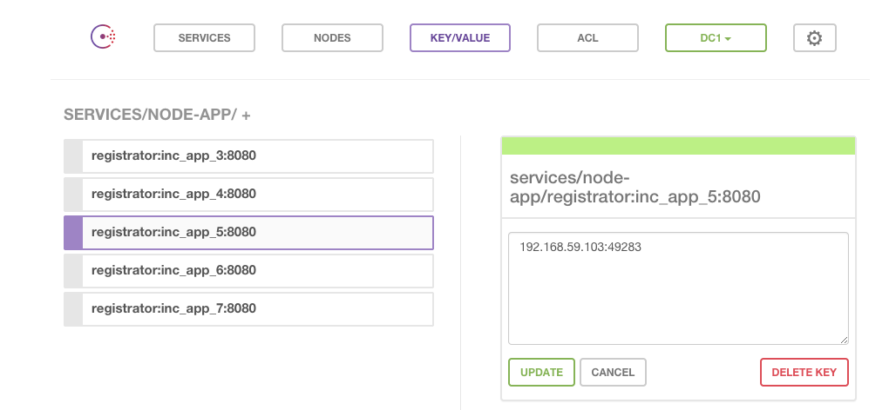

# autoscaling  node example


| container | description |
| :-------- | :---------- |
| app | simple node inc http service |
| redis | inc service store |
| nginx | http loadbalancer |
| consul-template | consul template |

## start the application

**WARNING**:
Change the Docker Host ip at the docker-compose*.yml files...


```
$ docker-compose build
$ docker-compose up -d
```

```
start the auto registration part
$ docker-compose -f docker-compose-discovery up -d
$ docker-compose scale app=2
```

## access this muliple times and change the number of hello servers!

```
$ NGINX_PORT=$(docker-compose port nginx 80 | awk -F":" '{print $2}')
$ while : ; do curl -Ls $(boot2docker ip):${NGINX_PORT} ; sleep 2 ; done
  This page has been viewed 1 times, at host bee160990b89 !
  This page has been viewed 2 times, at host 36dc4edfbe5d !
...
```

See that your hostname identifier is changed.


## rebuid app or discovery container

```
$ docker-compose build
$ docker-compose stop
$ docker-compose rm
$ docker-compose up -d
$ docker-compose -f docker-compose-discovery.yml build
...
```

## Debug Template with dry run

```
$ docker run -ti --rm --link inc_consul_1:consul \
 -e NGINX_CID=inc_nginx_1 \
 -v /usr/local/bin/docker:/usr/local/bin/docker \
 -v /var/run/docker.sock:/var/run/docker.sock \
 --volumes export:/app/export /bin/bash
> consul-template \
  -consul=consul:8500 \
  -dry \
  -log-level=debug \
  -template "/app/templates/nginx.conf:/app/export/etc/nginx/conf.d/node.conf:/app/restart-nginx.sh"
```

## Consul Console

```
open $(boot2docker ip):8500
# select key-value and services node-app
```



## Links

- http://2mohitarora.blogspot.de/2014/08/service-discovery-using-consul.html
- https://github.com/expressjs/morgan
- https://github.com/hashicorp/consul-template
- https://github.com/msanand/docker-workflow
- https://github.com/progrium/docker-consul
