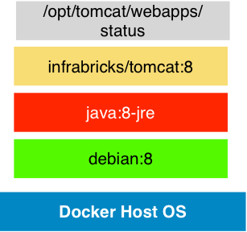
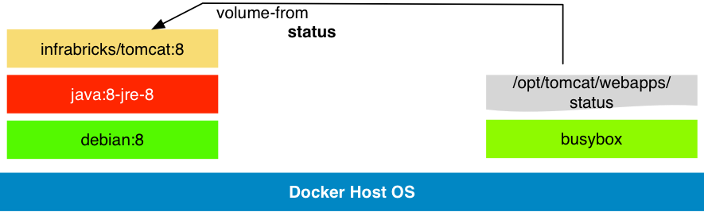
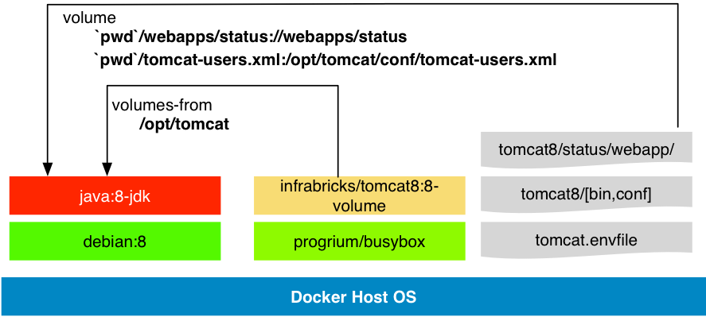

# Flexible Docker Apache Tomcat 8 container


* Based on official trustet docker inc openjdk java jre-8
* Install Apache Tomcat 8 Basic distribution
* Add jolokia jmx rest api to the distribution
* Tuned server.xml and logging.properties for production
* Access Log to stdout
* Drop all webapps and unused files
* Show some docker tricks
  * My webapp and tomcat docker composition pattern
  * JDK and Tomcat as docker data volume
  * Easy overwrite or extend Tomcat configs, webapps or libs



This implements some ideas from my german [tomcat blog post](http://www.infrabricks.de/blog/2014/12/19/docker-microservice-basis-mit-apache-tomcat-implementieren/).

Another minimal tomcat docker container example can you found at my github project [docker-simple-tomcat8](https://github.com/infrabricks/docker-simple-tomcat8).

## Build

Create the images with `./build.sh`

    $ ./build.sh
    $ docker images | grep infrabricks/tomcat
    infrabricks/tomcat                       8.0.21-dev          ad95cff93f75        9 minutes ago       868 MB
    infrabricks/tomcat                       8-dev               ad95cff93f75        9 minutes ago       868 MB
    infrabricks/tomcat                       8-volume            ce5c040a573f        15 minutes ago      13.35 MB
    infrabricks/tomcat                       8.0.21-volume       ce5c040a573f        15 minutes ago      13.35 MB
    infrabricks/tomcat                       201504120951        119751fe6d65        17 minutes ago      497.6 MB
    infrabricks/tomcat                       8.0.21              119751fe6d65        17 minutes ago      497.6 MB
    infrabricks/tomcat                       201504120955        119751fe6d65        17 minutes ago      497.6 MB
    infrabricks/tomcat                       8                   119751fe6d65        17 minutes ago      497.6 MB
    infrabricks/tomcat                       201504120947        119751fe6d65        17 minutes ago      497.6 MB
    infrabricks/tomcat                       latest              119751fe6d65        17 minutes ago      497.6 MB
    infrabricks/tomcat                       8.0.20              4b37f6bc7608        3 weeks ago         527.2 MB

Tomcat is small but Java with debian consume more then >497mb

## Use the images

Information about the installed tomcat version:

```bash
$ docker run --rm --entrypoint=/opt/tomcat/bin/version.sh infrabricks/tomcat:8-dev
Server version: Apache Tomcat/8.0.21
Server built:   Mar 23 2015 14:11:21 UTC
Server number:  8.0.21.0
OS Name:        Linux
OS Version:     3.18.5-tinycore64
Architecture:   amd64
JVM Version:    1.8.0_40-internal-b27
JVM Vendor:     Oracle Corporation
```

### Start a tomcat with simple webapp

```bash
$ mkdir -p webapps/status
$ cat >webapps/status/index.jsp <<EOF
<%@ page session="false" %>
<%=new java.util.Date()%>
EOF
$ CID=$(docker run -d -p 8002:8080 -v `pwd`/webapps/status:/opt/tomcat/webapps/status infrabricks/tomcat:8)
$ docker logs $CID
=> Creating and admin user with a random password in Tomcat
=> Done!
========================================================================
You can now configure to this Tomcat server using:

    admin:AicthGP20029

========================================================================
Checking *.war in /webapps
Checking tomcat extended libs *.jar in /libs
Get http:///var/run/docker.sock/v1.17/images/dab257bbb45e/json: dial unix /var/run/docker.sock: no such file or directory. Are you trying to connect to a TLS-enabled daemon without TLS?2015-03-17T12:56:08.446+0000 org.apache.catalina.startup.VersionLoggerListener log INFO: Server version:        Apache Tomcat/8.0.20
2015-03-17T12:56:08.448+0000 org.apache.catalina.startup.VersionLoggerListener log INFO: Server built:          Feb 15 2015 18:10:42 UTC
2015-03-17T12:56:08.449+0000 org.apache.catalina.startup.VersionLoggerListener log INFO: Server number:         8.0.20.0
2015-03-17T12:56:08.450+0000 org.apache.catalina.startup.VersionLoggerListener log INFO: OS Name:               Linux
2015-03-17T12:56:08.451+0000 org.apache.catalina.startup.VersionLoggerListener log INFO: OS Version:            3.18.5-tinycore64
2015-03-17T12:56:08.452+0000 org.apache.catalina.startup.VersionLoggerListener log INFO: Architecture:          amd64
2015-03-17T12:56:08.453+0000 org.apache.catalina.startup.VersionLoggerListener log INFO: Java Home:             /usr/lib/jvm/java-8-openjdk-amd64/jre
2015-03-17T12:56:08.459+0000 org.apache.catalina.startup.VersionLoggerListener log INFO: JVM Version:           1.8.0_40-internal-b22
2015-03-17T12:56:08.461+0000 org.apache.catalina.startup.VersionLoggerListener log INFO: JVM Vendor:            Oracle Corporation
2015-03-17T12:56:08.461+0000 org.apache.catalina.startup.VersionLoggerListener log INFO: CATALINA_BASE:         /opt/tomcat
2015-03-17T12:56:08.462+0000 org.apache.catalina.startup.VersionLoggerListener log INFO: CATALINA_HOME:         /opt/tomcat
2015-03-17T12:56:08.463+0000 org.apache.catalina.startup.VersionLoggerListener log INFO: Command line argument: -Djava.util.logging.config.file=/opt/tomcat/conf/logging.properties
2015-03-17T12:56:08.464+0000 org.apache.catalina.startup.VersionLoggerListener log INFO: Command line argument: -Djava.util.logging.manager=org.apache.juli.ClassLoaderLogManager
2015-03-17T12:56:08.464+0000 org.apache.catalina.startup.VersionLoggerListener log INFO: Command line argument: -Duser.language=en
2015-03-17T12:56:08.465+0000 org.apache.catalina.startup.VersionLoggerListener log INFO: Command line argument: -Duser.country=US
2015-03-17T12:56:08.466+0000 org.apache.catalina.startup.VersionLoggerListener log INFO: Command line argument: -Xmx512m
2015-03-17T12:56:08.467+0000 org.apache.catalina.startup.VersionLoggerListener log INFO: Command line argument: -Djava.awt.headless=true
2015-03-17T12:56:08.467+0000 org.apache.catalina.startup.VersionLoggerListener log INFO: Command line argument: -DjvmRoute=dab257bbb45e
2015-03-17T12:56:08.468+0000 org.apache.catalina.startup.VersionLoggerListener log INFO: Command line argument: -Dtomcat.maxThreads=250
2015-03-17T12:56:08.469+0000 org.apache.catalina.startup.VersionLoggerListener log INFO: Command line argument: -Dtomcat.minSpareThreads=4
2015-03-17T12:56:08.470+0000 org.apache.catalina.startup.VersionLoggerListener log INFO: Command line argument: -Dtomcat.httpTimeout=20000
2015-03-17T12:56:08.471+0000 org.apache.catalina.startup.VersionLoggerListener log INFO: Command line argument: -Dtomcat.ajpTimeout=410000
2015-03-17T12:56:08.471+0000 org.apache.catalina.startup.VersionLoggerListener log INFO: Command line argument: -Djava.security.egd=file:/dev/./urandom
2015-03-17T12:56:08.472+0000 org.apache.catalina.startup.VersionLoggerListener log INFO: Command line argument: -Dsun.net.client.defaultReadTimeout=180000
2015-03-17T12:56:08.473+0000 org.apache.catalina.startup.VersionLoggerListener log INFO: Command line argument: -Dsun.net.client.defaultConnectTimeout=180000
2015-03-17T12:56:08.473+0000 org.apache.catalina.startup.VersionLoggerListener log INFO: Command line argument: -Djava.net.preferIPv4Stack=true
2015-03-17T12:56:08.474+0000 org.apache.catalina.startup.VersionLoggerListener log INFO: Command line argument: -Dsun.net.inetaddr.ttl=15
2015-03-17T12:56:08.475+0000 org.apache.catalina.startup.VersionLoggerListener log INFO: Command line argument: -Djava.rmi.server.hostname=127.0.0.1
2015-03-17T12:56:08.475+0000 org.apache.catalina.startup.VersionLoggerListener log INFO: Command line argument: -Djava.rmi.server.useLocalHostname=true
2015-03-17T12:56:08.476+0000 org.apache.catalina.startup.VersionLoggerListener log INFO: Command line argument: -Dcom.sun.management.jmxremote
2015-03-17T12:56:08.477+0000 org.apache.catalina.startup.VersionLoggerListener log INFO: Command line argument: -Dcom.sun.management.jmxremote.ssl=false
2015-03-17T12:56:08.477+0000 org.apache.catalina.startup.VersionLoggerListener log INFO: Command line argument: -Dcom.sun.management.jmxremote.authenticate=false
2015-03-17T12:56:08.479+0000 org.apache.catalina.startup.VersionLoggerListener log INFO: Command line argument: -Djava.endorsed.dirs=/opt/tomcat/endorsed
2015-03-17T12:56:08.480+0000 org.apache.catalina.startup.VersionLoggerListener log INFO: Command line argument: -Dcatalina.base=/opt/tomcat
2015-03-17T12:56:08.480+0000 org.apache.catalina.startup.VersionLoggerListener log INFO: Command line argument: -Dcatalina.home=/opt/tomcat
2015-03-17T12:56:08.481+0000 org.apache.catalina.startup.VersionLoggerListener log INFO: Command line argument: -Djava.io.tmpdir=/opt/tomcat/temp
2015-03-17T12:56:08.577+0000 org.apache.coyote.AbstractProtocol init INFO: Initializing ProtocolHandler ["http-nio-8080"]
2015-03-17T12:56:08.592+0000 org.apache.tomcat.util.net.NioSelectorPool getSharedSelector INFO: Using a shared selector for servlet write/read
2015-03-17T12:56:08.595+0000 org.apache.coyote.AbstractProtocol init INFO: Initializing ProtocolHandler ["ajp-nio-8009"]
2015-03-17T12:56:08.597+0000 org.apache.tomcat.util.net.NioSelectorPool getSharedSelector INFO: Using a shared selector for servlet write/read
2015-03-17T12:56:08.598+0000 org.apache.catalina.startup.Catalina load INFO: Initialization processed in 572 ms
2015-03-17T12:56:08.636+0000 org.apache.catalina.core.StandardService startInternal INFO: Starting service Catalina
2015-03-17T12:56:08.636+0000 org.apache.catalina.core.StandardEngine startInternal INFO: Starting Servlet Engine: Apache Tomcat/8.0.20
2015-03-17T12:56:08.674+0000 org.apache.catalina.startup.HostConfig deployWAR INFO: Deploying web application archive /opt/tomcat/webapps/jolokia.war
2015-03-17T12:56:09.192+0000 org.apache.catalina.core.ApplicationContext log INFO: jolokia-agent: Using access restrictor classpath:/jolokia-access.xml
2015-03-17T12:56:09.349+0000 org.apache.catalina.startup.HostConfig deployWAR INFO: Deployment of web application archive /opt/tomcat/webapps/jolokia.war has finished in 675 ms
2015-03-17T12:56:09.351+0000 org.apache.catalina.startup.HostConfig deployDirectory INFO: Deploying web application directory /opt/tomcat/webapps/status
2015-03-17T12:56:09.407+0000 org.apache.catalina.startup.HostConfig deployDirectory INFO: Deployment of web application directory /opt/tomcat/webapps/status has finished in 56 ms
2015-03-17T12:56:09.408+0000 org.apache.catalina.startup.HostConfig deployDirectory INFO: Deploying web application directory /opt/tomcat/webapps/manager
2015-03-17T12:56:09.457+0000 org.apache.catalina.startup.HostConfig deployDirectory INFO: Deployment of web application directory /opt/tomcat/webapps/manager has finished in 49 ms
2015-03-17T12:56:09.466+0000 org.apache.coyote.AbstractProtocol start INFO: Starting ProtocolHandler ["http-nio-8080"]
2015-03-17T12:56:09.471+0000 org.apache.coyote.AbstractProtocol start INFO: Starting ProtocolHandler ["ajp-nio-8009"]
2015-03-17T12:56:09.473+0000 org.apache.catalina.startup.Catalina start INFO: Server startup in 874 ms
```

### Access the application
```
$ boot2docker ssh
> IP=$(docker inspect --format '{{ .NetworkSettings.IPAddress }}' ${CID})
> echo $IP
172.17.0.71
> curl -s http://$IP:8080/status/index.jsp

Tue Mar 17 12:59:19 UTC 2015
> exit
$ curl -s http://$(boot2docker ip):8002/status.jsp

Tue Mar 17 12:59:56 UTC 2015
```

### Use the tomcat manager



**tomcat-users.xml**
```xml
<?xml version='1.0' encoding='utf-8'?>
<<tomcat-users xmlns="http://tomcat.apache.org/xml"
  xmlns:xsi="http://www.w3.org/2001/XMLSchema-instance"
  xsi:schemaLocation="http://tomcat.apache.org/xml tomcat-users.xsd"
  version="1.0">

  <role rolename="manager-script"/>
  <user username="manager" password="tomcat" roles="manager-script"/>
</tomcat-users>
```

```bash
$ docker stop $CID
$ docker rm $CID
$ docker run -d -p 8002:8080 \
 -v `pwd`/webapps/status:/opt/tomcat/webapps/status \
 -v `pwd`/tomcat-users-xml:/opt/tomcat/conf/tomcat-users.xml \
infrabricks/tomcat:8
$ CID=$(docker ps -lq)
$ IP=$(docker inspect --format '{{ .NetworkSettings.IPAddress }}' ${CID})
$ curl -su manager:tomcat http://$(boot2docker ip):8002/manager/text/list
OK - Listed applications for virtual host localhost
/status:running:0:status
/manager:running:0:manager
/jolokia:running:0:jolokia
```

### Use JDK with tomcat 8 volume container and local app



docker-compose.yml

```
tomcatvolume:
  image: infrabricks/tomcat:8-volume
tomcat:
  image: java:8-jdk
  ports:
    - "8080"
    - "8009"
  env_file: tomcat.envfile
  volumes_from:
    - tomcatvolume
  volumes:
    - webapps/status:/webapps/status
    - /var/run/docker.sock:/var/run/docker.sock
    - /usr/local/bin/docker:/usr/local/bin/docker
  environment:
    CATALINA_HOME: /opt/tomcat
    constraint: zone==dev
    constraint: disk==ssd
    SERVICE_8080_NAME: status-http
    SERVICE_8009_NAME: status-ajp
    SERVICE_TAGS: tomcat
    SERVICE_REGION: bee42.1
  working_dir: /opt/tomcat
  command: /opt/tomcat/bin/tomcat.sh
```

build and run


```
docker build -t infrabricks/tomcat:8-volume -f Dockerfile.volume .
docker-compose up -d
```

* Overwriting configs is supported.
  * Container volumes can't overlay
* Don't use same tomcat volume data container at multiple tomcat containers.
* use Docker binary to detect the container name (auto setting JVM_ROUTE with consul)

### Install tcnative at debian

see Dockerfile.tcnative

**Warning**: This is only a 1.3.32 old version

```
FROM infrabricks/tomcat:8

MAINTAINER Peter Rossbach <peter.rossbach@bee42.com>

ENV LD_LIBRARY_PATH=${LD_LIBRARY_PATH}:/usr/lib/x86_64-linux-gnu/

RUN \
  apt-get update \
  && apt-get install -yq libtcnative-1 \
  && apt-get clean autoclean \
  && apt-get autoremove -y \
  && rm -rf /var/lib/{apt,dpkg,cache,log}/
```

* [Tomcat tcnative documentation](http://tomcat.apache.org/native-doc/)
* Build newest tcnative version ../tomcat8-tcnative

### Use Jolokia

$ docker exec -ti tomcat8_tomcat_1 /bin/bash
> curl 127.0.0.1:8080/jolokia/version | jq "."
{
  "request": {
    "type": "version"
  },
  "value": {
    "agent": "1.2.3",
    "protocol": "7.2",
    "config": {
      "maxCollectionSize": "1000",
      "agentId": "172.17.0.181-1-4697411f-servlet",
      "debug": "false",
      "agentType": "servlet",
      "serializeException": "false",
      "detectorOptions": "{}",
      "dispatcherClasses": "org.jolokia.jsr160.Jsr160RequestDispatcher",
      "maxDepth": "15",
      "discoveryEnabled": "false",
      "canonicalNaming": "true",
      "historyMaxEntries": "10",
      "includeStackTrace": "true",
      "maxObjects": "0",
      "debugMaxEntries": "100"
    },
    "info": {
      "product": "tomcat",
      "vendor": "Apache",
      "version": "8.0.21"
    }
  },
  "timestamp": 1428822431,
  "status": 200
}
> curl -Ls 127.0.0.1:8080/jolokia/read/java.lang:type=Memory | jq "."
{
  "request": {
    "mbean": "java.lang:type=Memory",
    "type": "read"
  },
  "value": {
    "ObjectPendingFinalizationCount": 0,
    "Verbose": false,
    "HeapMemoryUsage": {
      "init": 33554432,
      "committed": 77594624,
      "max": 477626368,
      "used": 41087240
    },
    "NonHeapMemoryUsage": {
      "init": 2555904,
      "committed": 34865152,
      "max": -1,
      "used": 33903744
    },
    "ObjectName": {
      "objectName": "java.lang:type=Memory"
    }
  },
  "timestamp": 1428822529,
  "status": 200
}
```

* [Jolokia Reference Manual](https://jolokia.org/reference/html/index.html)
* Review the restrictions at `lib/jolokia-access.xml`

### Change version

Set TOMCAT_VERSION at this files:

* build.sh
* Dockerfile

**WARNING**: Check gpg keys from authors site if you change the version!

jolokia

```
gpg --verify jolokia.war.asc
gpg --keyserver pgpkeys.mit.edu --recv-key EF101165
#Roland Huss <roland@jolokia.org>
```

Apache Tomcat

* https://www.apache.org/info/verification.html
* Tomcat Keys file http://svn.apache.org/repos/asf/tomcat/trunk/KEYS

## User Feedback

See my [infrabricks blog](http://www.infrabricks.de) to more informations.

Contact me: Peter <peter.rossbach@bee42.com>

Follow me [on Twitter](https://twitter.com/PRossbach)

### Issues

If you have any problems with or questions about this image, please contact us through a GitHub issue.

* [infrabricks-line](https://github.com/infrabricks/infrabricks-line)


* Setting unique JVM_ROUTE that can be used as mod_jk worker name
* build all container with Docker Hub CI
* mod_jk integration

### Contributing

You are invited to contribute new features, fixes, or updates, large or small; we are always thrilled to receive pull requests, and do our best to process them as fast as we can.

Before you start to code, we recommend discussing your plans through a GitHub issue, especially for more ambitious contributions. This gives other contributors a chance to point you in the right direction, give you feedback on your design, and help you find out if someone else is working on the same thing.

## Power by Apache Tomcat


## References

* [Apache Tomcat](https://tomcat.apache.org)
* [Docker](https://docker.com)
* [Infrabricks Blog](http://www.infrabricks.de)
* [Tomcat Docker hub library images](https://registry.hub.docker.com/u/library/tomcat/)
* [jolokia](http://www.jolokia.org/)
* [Docker maven plugin](https://github.com/rhuss/docker-maven-plugin)

## Possible Add ons

* load balancing
* mod_jk integration
* tcnative support
  * compile from source
* memcache
* tomcat ha cluster
* add a developer version (JDK all examples)
